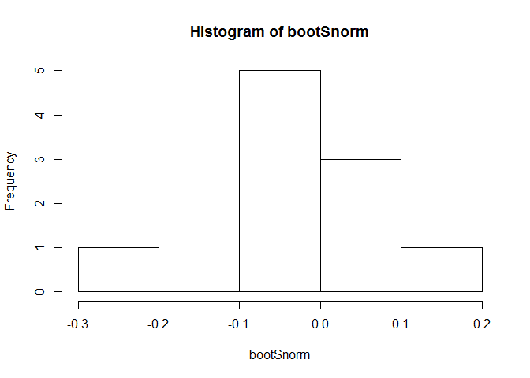
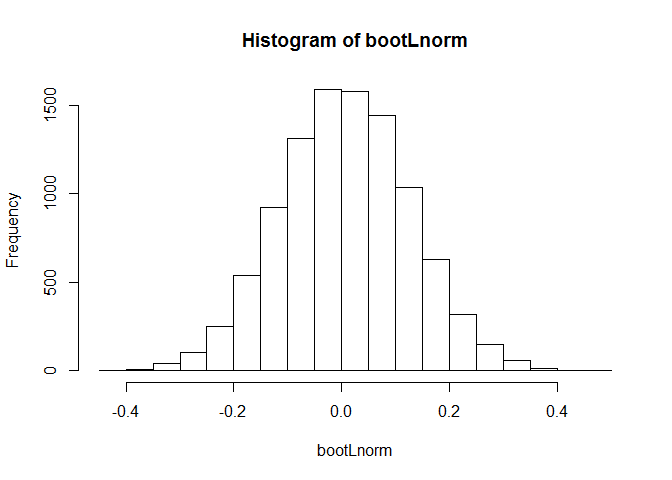
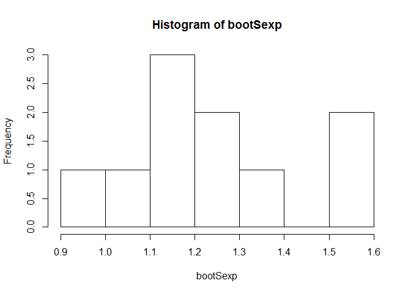
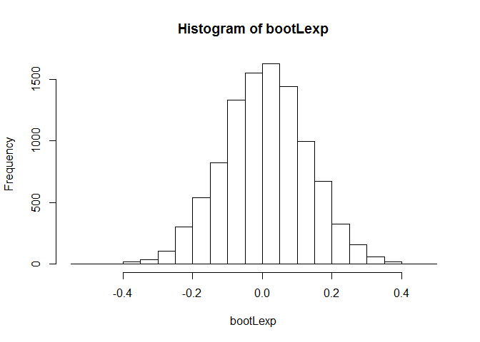

# HW4
Kevin Cannon  
October 31, 2016  


Bootstrap Code

# Initialize variables

```r
nsmall <- 10                  # small sample size
nlarge <- 10000               # large sample size
obs <- 50                     # number of observations to create samples
bootSnorm <- numeric(nsmall)  # bootstrap for small normal sample
bootLnorm <- numeric(nlarge)  # bootstrap for large normal sample
bootSexp <- numeric(nsmall)  # bootstrap for small exponential sample
bootLexp <- numeric(nlarge)  # bootstrap for large exponential sample
```

# Create normal distribution vector to use with two different sample sizes

```r
normdist <- rnorm(obs, mean=0, sd=1) 
```

# Bootstrap loop calculations for small sample size

```r
for (i in 1:nsmall) {
bootSnorm[i] <- mean(sample(normdist, obs, replace=TRUE)) # find mean of sampling and assign during loop
}
hist(bootSnorm) # plot histogram to see sampling loop output
```

<!-- -->

The small normal sampling does not produce a normal distribution of means.


# Bootstrap loop calculations for large sample size

```r
for (i in 1:nlarge) {
bootLnorm[i] <- mean(sample(normdist, obs, replace=TRUE)) # find mean of sampling and assign during loop
}
hist(bootLnorm) # plot histogram to see sampling loop output
```

<!-- -->

The large normal sampling does produce a normal distribution of means.

# Create expnonential distribution vector to use with two different sample sizes

```r
expdist <- rexp(obs)
```

# Bootstrap loop calculations for small sample size

```r
for (i in 1:nsmall) {
bootSexp[i] <- mean(sample(expdist, obs, replace=TRUE)) # find mean of sampling and assign during loop
}
hist(bootSexp) # plot histogram to see sampling loop output
```

<!-- -->

The small exponential sampling does not produce a normal distribution of means.

# Bootstrap loop calculations for large sample size

```r
for (i in 1:nlarge) {
bootLexp[i] <- mean(sample(normdist, obs, replace=TRUE)) # find mean of sampling and assign during loop
}
hist(bootLexp) # plot histogram to see sampling loop output
```

<!-- -->

The large exponential sampling does produce a normal distribution of means. In the instances of both the normal and exponential distributions, the distribution of the sampling means more closely approached normality as the number of sampling observations increased toward infinity.
